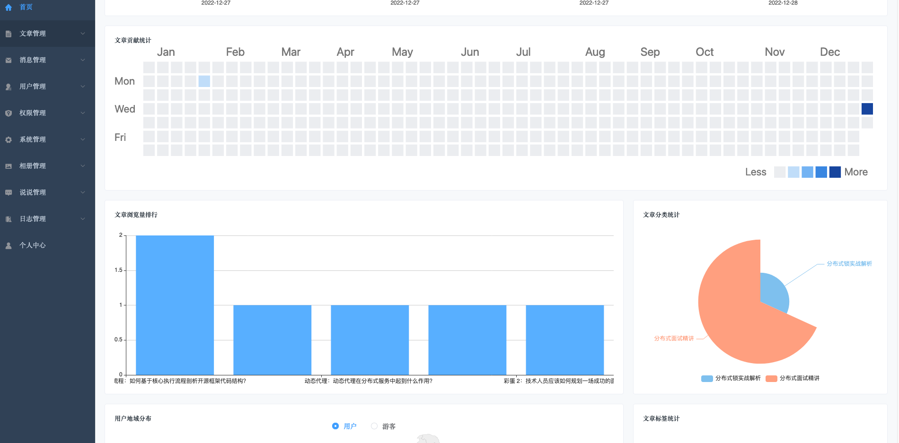
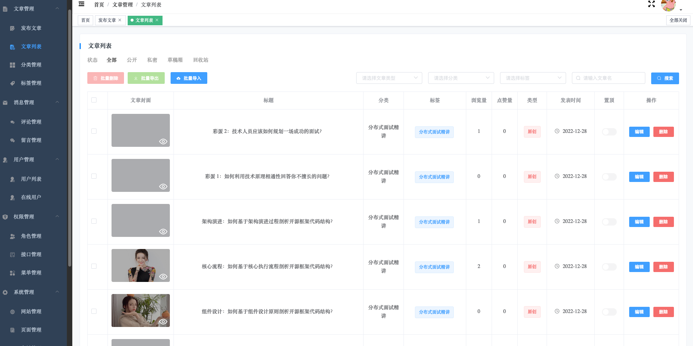
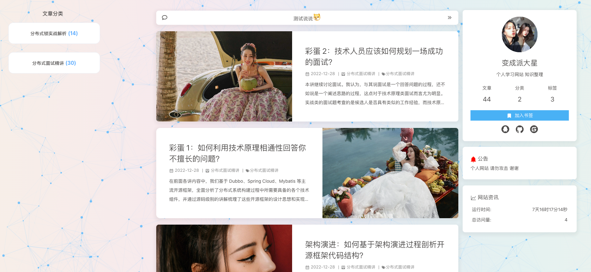
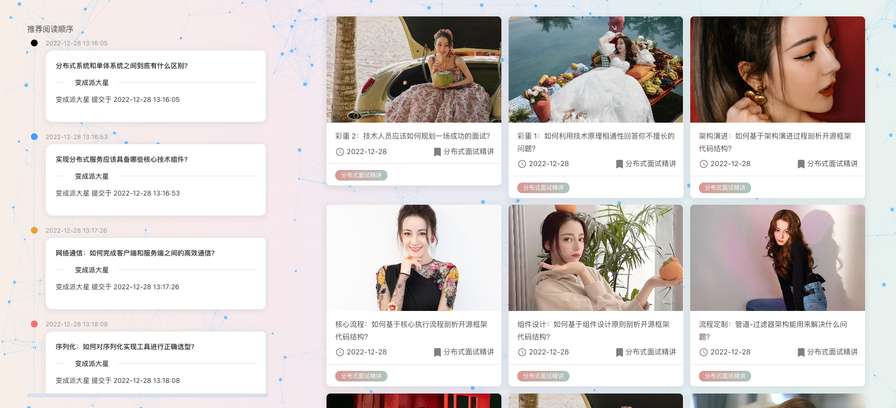
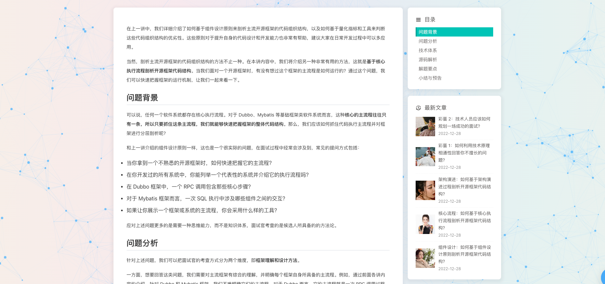

## 博客介绍

<p align=center>
  <a href="https://www.talkxj.com">
    
  </a>
</p>

<p align=center>
   基于Springboot + Vue 开发的前后端分离博客
</p>

<p align="center">
   <a target="_blank" href="https://github.com/X1192176811/blog">
      
      
      
      
      
      
      
      
      
   </a>
</p>

[在线地址](#在线地址) | [目录结构](#目录结构) | [项目特点](#项目特点) | [技术介绍](#技术介绍) | [运行环境](#运行环境) | [开发环境](#开发环境) | [项目截图](#项目截图) | [快速开始](#快速开始) | [注意事项](#注意事项) | [项目总结](#项目总结) | [交流群](#交流群)

## 在线地址

**项目链接：** [变成派大星](http://www.hughswb.com)

**后端截图**




**Github地址：** [https://github.com/hugnsun/hughswb_blog](https://github.com/hugnsun/hughswb_blog)


您的star是我坚持的动力，感谢大家的支持，欢迎提交pr共同改进项目。

## 目录结构

前端项目位于hughswb-vue下，hughswb_blog为前台，hughswb_admin为后台。

后端项目位于hughswb_after下。

SQL文件位于根目录下的blog-mysql8.sql，需要MYSQL8以上版本。

可直接导入该项目于本地，修改后端配置文件中的数据库等连接信息，项目中使用到的关于阿里云功能和第三方授权登录等需要自行开通。

当你克隆项目到本地后可使用邮箱账号：admin@qq.com，密码：1234567 进行登录，也可自行注册账号并将其修改为admin角色。

本地访问接口文档地址：[http://127.0.0.1:8080/doc.html](http://127.0.0.1:8080/doc.html)

**ps：请先运行后端项目，再启动前端项目，前端项目配置由后端动态加载。** 

```
blog-springboot
├── annotation    --  自定义注解
├── aspect        --  aop模块
├── config        --  配置模块
├── constant      --  常量模块
├── consumer      --  MQ消费者模块
├── controller    --  控制器模块
├── dao           --  框架核心模块
├── dto           --  dto模块
├── enums         --  枚举模块
├── exception     --  自定义异常模块
├── handler       --  处理器模块（扩展Security过滤器，自定义Security提示信息等）
├── service       --  服务模块
├── strategy      --  策略模块（用于扩展第三方登录，搜索模式，上传文件模式等策略）
├── util          --  工具类模块
└── vo            --  vo模块
```

## 项目特点

- 前台参考"Hexo"的"Butterfly"设计，美观简洁，响应式体验好。
- 后台参考"element-admin"设计，侧边栏，历史标签，面包屑自动生成。
- 采用Markdown编辑器，写法简单。
- 评论支持表情输入回复等，样式参考Valine。
- 添加音乐播放器，支持在线搜索歌曲。
- 前后端分离部署，适应当前潮流。
- 接入第三方登录，减少注册成本。
- 支持发布说说，随时分享趣事。
- 留言采用弹幕墙，更加炫酷。
- 支持代码高亮和复制，图片预览，深色模式等功能，提升用户体验。
- 搜索文章支持高亮分词，响应速度快。
- 新增文章目录、推荐文章等功能，优化用户体验。
- 新增在线聊天室，支持撤回、语音输入、统计未读数量等功能。
- 新增aop注解实现日志管理。  
- 支持动态权限修改，采用RBAC模型，前端菜单和后台权限实时更新。
- 后台管理支持修改背景图片，博客配置等信息，操作简单，支持上传相册。
- 代码支持多种搜索模式（Elasticsearch或MYSQL），支持多种上传模式（OSS或本地），可支持配置。
- 代码遵循阿里巴巴开发规范，利于开发者学习。

## 技术介绍

**前端：** vue + vuex + vue-router + axios + vuetify + element + echarts

**后端：** SpringBoot + nginx + docker + SpringSecurity + Swagger2 + MyBatisPlus + Mysql + Redis + elasticsearch + RabbitMQ + MaxWell + Websocket

**其他：** 接入QQ，微博第三方登录，接入腾讯云人机验证、websocket

## 运行环境

**服务器：** 腾讯云2核4G CentOS7.6

**CDN：** 阿里云全站加速

**对象存储：** 阿里云OSS

这套搭配响应速度非常快，可以做到响应100ms以下。

**最低配置：** 1核2G服务器（关闭ElasticSearch）

## 开发环境

|开发工具|说明|
|-|-|
|IDEA|Java开发工具IDE|
|VSCode|Vue开发工具IDE|
|Navicat|MySQL远程连接工具|
|Another Redis Desktop Manager|Redis远程连接工具|
|X-shell|Linux远程连接工具|
|Xftp|Linux文件上传工具|

|开发环境|版本|
|-|-|
|JDK|1.8|
|MySQL|8.0.20|
|Redis|6.0.5|
|Elasticsearch|7.9.2|
|RabbitMQ|3.8.5|

## 项目截图








## 快速开始

### 懒人教程

考虑到本人很懒，且学生机到期之后经常会迁移自己的博客到其他云厂商的服务器，所以为centos7操作系统提供了一键部署脚本install.sh

```shell
sh install.sh
```

按提示输入配置信息即可

博客首页:http://你的IP:80

管理后台:http://你的IP:81

一些配置在宿主机的/blog/dev文件夹下，有需求的话自己修改就好。

## 注意事项

- 项目拉下来运行后，可到后台管理页面网站配置处修改博客相关信息.
- 邮箱配置，第三方授权配置需要自己申请。
- ElasticSearch需要自己先创建索引，项目运行环境教程中有介绍。

## 项目总结

博客作为新手入门项目是十分不错的，项目所用的技术栈覆盖的也比较广，适合初学者学习。主要难点在于权限管理、第三方登录、websocket这块。做的不好的地方请大家见谅，有问题的或者有好的建议可以私聊联系我。


